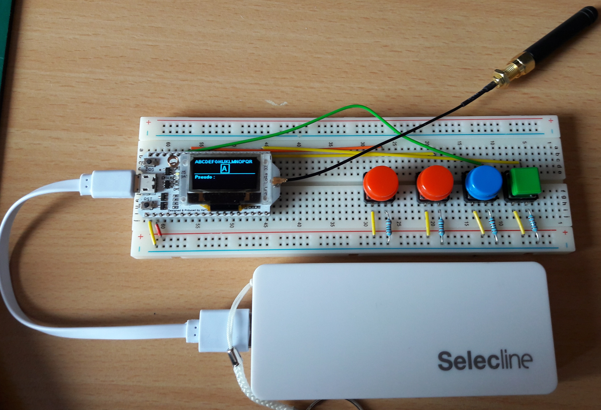

# Lora CHAT ESP32 OLED : A autonomous Lora Chat 

---

---

## Context

A tweaked out version from : https://github.com/unprovable/LoRaChat

Just add some buttons, and code to make it autonomous

## Technical details

The board is a : [Heltec ESP32 LORA](https://robotzero.one/heltec-wifi-lora-32/)

It's NOT LORAWAN compliant ... In fact it's more a Proof of Concept than a real project ...

But it works ! And i made a few tests of distance coverage, i can confirm that it's quite impressive ! 

With more options, a clean code and some final design... it can make a decent "off the grid" pager ;-)

See yeah
